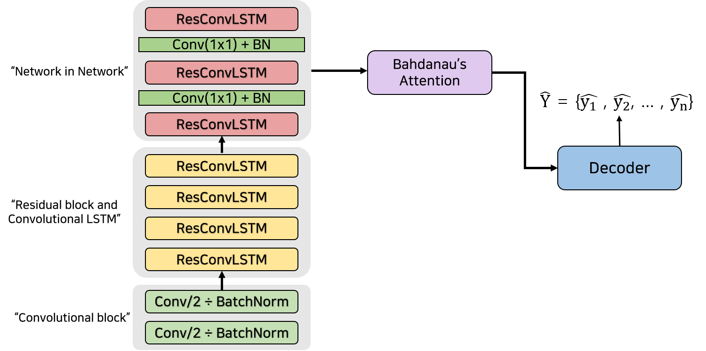

# paper_review

## A spelling correction model for end-to-end speech recognition

Link : https://arxiv.org/pdf/1902.07178.pdf

### Abstract

1. Limitations of existing research

   - End-to-End speech recognition model : 

     The number of audio-text pair dataset size is very small. So that model can't analysis rare words

   - Fusion with Pre-trained RNN-LM model and recognition model :

     Pre-trained RNN-LM cannot refer the sentence that made by the recognition model.

2. suggesting methodology

   - Creating the text-text pair data  with STT(Speech to Text) → TTS(Text to Speech) → STT  like backtranslation technique like neural machine translation
   - Fusion with pre-trained SC(speech correction model),  RNN-LM, recognition model

### Baseline Model

1. LAS([Very deep convolutional networks for end-to-end speech recognition](https://arxiv.org/pdf/1610.03022.pdf))

   - The characteristic of the baseline LAS model
     - Residual Connection : That can be able to make a deeper model. Because it helps optimize and generalize.
     - Network-in-Network(NiN) : this allows increasing the depth and expressive power of a network. And allows reducing total parameters.
     - Convolutional LSTM(ConvLSTM) : That can be able to maintain structural  representation of the features.

   