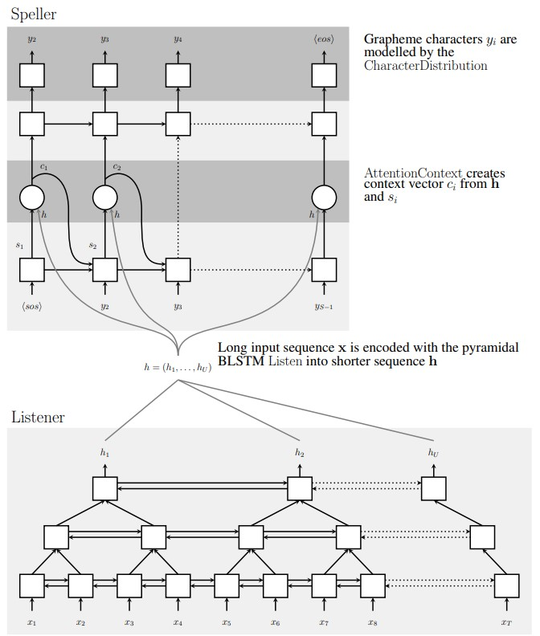

# paper_review

## Listen, Attend and Spell

Link : [https://arxiv.org/pdf/1508.01211.pdf](https://arxiv.org/pdf/1508.01211.pdf)

### Introduction

1. Limitation of existing research

   - CTC based recognition model : assuming that label outputs are conditionally independent of each other.
   - Sequence to Sequence based model : S2S model applied only phoneme sequences. And S2S model can't train end-to-end model.

   - HMMㆍCRF based model : That model is hard to train at end-to-end model.   

2. New Approach for Neural net based Model.

   - Pyramid RNN Encoder : Pyramid RNN Encoder reduces the number of time-steps. So the Attention Mechanism can extract less feature. And the model can able to process multiple representation. Finally, the model can prevent overfitting.
   - Attention Mechanism : Attention Mechanism reduce model's overfitting in training step. And that acts as a like skip-connection that allow the sending information to Decoder and the gradient flow more effectively in entire Model. 

### Related Work

That Section introduce the Attention's effect and sequence to sequence model.

### Model 

 

- The characteristic of this model
  1. Listener
     - Pyramid Bidirectional LSTM(pBLSTM)
  2. Attend and Speller
     - Attention
     - Stacked LSTM

- RNN-LM
- 